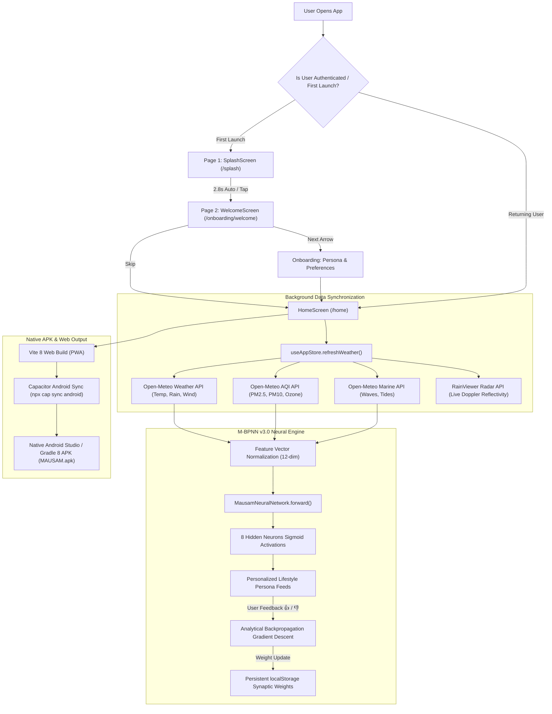

# 🇮🇳 MAUSAM Mega Unified Platform - Complete Technical, API & Function Reference Manual

---

## 1. Executive Project Overview
**MAUSAM** (Smart Subcontinent Weather & Lifestyle Intelligence Platform) is an advanced, production-grade meteorological application built for the **Ministry of Earth Sciences (MoES)** and the **India Meteorological Department (IMD)**. 

The platform bridges raw atmospheric data from ground automatic weather stations (AWS), Doppler weather radars (DWR), and INSAT geostationary satellites into **actionable, personalized intelligence** for Indian citizens across 8 lifestyle domains:
1. 🌾 **Farmer / Agromet**: Soil moisture, evapotranspiration, rainfall timing, frost & mildew defense.
2. 🏃 **Fitness / Athlete**: Thermal strain, optimal training windows, UV & hydration indices.
3. 🚗 **Daily Commuter**: Road slickness, low-visibility fog hazards, transit delays.
4. 🩺 **Health / Sensitive**: CPCB Air Quality Index (AQI), PM2.5/PM10 thresholds, respiratory alerts.
5. 🏖️ **Coastal / Beachgoer**: INCOIS sea swell heights, tide status, rip current warnings.
6. 🧳 **Traveler**: Destination microclimates, hill station packing guides, diurnal ranges.
7. 👨‍👩‍👧 **Parent / Family**: School commute safety, playground weather, extreme heat safeguards.
8. 🎪 **Event Planner**: Convective storm risk, open-air venue viability, wind gust limits.

---

## 2. Programming Languages & Technology Stack

| Layer | Technology | Version | Purpose |
|---|---|---|---|
| **Core Language** | **TypeScript** | `v5.8+` | Strict static typing, interfaces, and compile-time correctness across all modules |
| **Runtime / Scripting**| **JavaScript (ES2022)** & **Python** | `Python 3.13` | Web runtime execution and asset processing / PIL image generation scripts |
| **UI Framework** | **React** | `v19.0.0` | Declarative component architecture with concurrent rendering and hooks |
| **Build & Dev Tool** | **Vite** | `v8.2.2` | Lightning-fast ESM dev server with Hot Module Replacement (HMR) and Rollup bundling |
| **Styling & Design** | **Tailwind CSS** | `v3.4.17` | Utility-first, responsive CSS engine with custom safe-area-inset mobile support |
| **State Management** | **Zustand** | `v5.0.3` | Lightweight flux store with automatic `localStorage` persistence & schema rehydration |
| **Mapping & GIS** | **Leaflet** & **React-Leaflet** | `v1.9.4` | High-performance interactive maps, Doppler radar tile layers & INSAT overlays |
| **Data Visualization** | **Recharts** | `v3.1.0` | Responsive SVG area and line charts for 24h/10-day meteorological trends |
| **Icons & Visuals** | **Lucide React** | `v0.475.0` | Lightweight vector icon library for meteorological and navigation symbols |
| **Mobile Runtime** | **Capacitor** | `v7.0.1` | Native Android bridge generating single standalone APK (`android/` platform) |
| **Native Mobile** | **Java / Gradle** | `Java 21 / Gradle 8.x` | Android native compilation and production APK signing |
| **Cloud Auth (SSO)** | **Clerk SDK** | `@clerk/clerk-react` | Enterprise Single Sign-On (Google, Social, Email), session tokens, user avatars |
| **Offline & PWA** | **Vite PWA / Workbox** | `v1.3.0` | Service Worker precaching, offline fallback caching, web app manifest |

---

## 3. Comprehensive API Integration Directory

### 3.1 External Meteorological & Geocoding APIs

#### 1. Open-Meteo Weather Forecast API
- **Endpoint**: `https://api.open-meteo.com/v1/forecast`
- **Method**: `GET`
- **Parameters**: `latitude`, `longitude`, `current`, `hourly`, `daily`, `timezone=auto`, `forecast_days=10`
- **Data Retrieved**:
  - `current`: Real-time temperature ($2m$), apparent temperature ("feels like"), relative humidity, wind speed ($10m$), wind direction, wind gusts, atmospheric surface pressure, precipitation amount, WMO weather code, day/night indicator.
  - `hourly`: 36-hour sequence of temperatures, precipitation probabilities ($0-100\%$), rain volume ($mm$), UV index, wind speed.
  - `daily`: 10-day forecast of max/min temperatures, precipitation sums, rain probability max, sunrise & sunset times, max UV index.

#### 2. Open-Meteo Air Quality API
- **Endpoint**: `https://air-quality-api.open-meteo.com/v1/air-quality`
- **Method**: `GET`
- **Parameters**: `latitude`, `longitude`, `current=european_aqi,us_aqi,pm10,pm2_5,carbon_monoxide,nitrogen_dioxide,ozone,alder_pollen,birch_pollen,grass_pollen`
- **Data Retrieved**:
  - US AQI & European AQI, particulate matter ($PM_{2.5}, PM_{10}$ in $\mu g/m^3$), gaseous pollutants ($NO_2, SO_2, CO, O_3$), pollen allergen levels (Tree, Grass, Weed).

#### 3. Open-Meteo Marine & Oceanographic API
- **Endpoint**: `https://marine-api.open-meteo.com/v1/marine`
- **Method**: `GET`
- **Parameters**: `latitude`, `longitude`, `current=wave_height,wave_direction,wave_period`
- **Data Retrieved**: Significant wave height ($m$), wave direction ($^\circ$), wave period ($s$), coastal swim safety classification.

#### 4. Open-Meteo Forward Geocoding API
- **Endpoint**: `https://geocoding-api.open-meteo.com/v1/search`
- **Method**: `GET`
- **Parameters**: `name`, `count=10`, `language=en`, `format=json`
- **Data Retrieved**: Indian city/town coordinates (latitude, longitude), state/region administrative names, elevation.

#### 5. BigDataCloud Reverse Geocoding API
- **Endpoint**: `https://api.bigdatacloud.net/data/reverse-geocode-client`
- **Method**: `GET`
- **Parameters**: `latitude`, `longitude`, `localityLanguage=en`
- **Data Retrieved**: Converts live GPS coordinates into local Indian city, district, and state names.

#### 6. RainViewer Doppler Radar Weather Tile API
- **Timeline Discovery**: `https://api.rainviewer.com/public/weather-maps.json`
- **Tile Format**: `https://tilecache.rainviewer.com{path}/256/{z}/{x}/{y}/2/1_1.png`
- **Purpose**: Real-time live precipitation radar loop animation with dynamic hash-based time paths.

#### 7. TomTom Routing & Traffic API
- **Endpoint**: `https://api.tomtom.com/routing/1/calculateRoute/`
- **Method**: `GET`
- **Purpose**: Calculates route transit travel duration, congestion delays, and corridor weather hazards.

#### 8. Clerk Cloud Identity & Authentication API
- **SDK**: `@clerk/clerk-react`
- **Purpose**: Handles authentication token verification, OAuth single sign-on (Google, Apple, email), user avatar URLs, and profile synchronization.

---

## 4. Source Code Architecture & File Structure

```
d:/sih/
├── android/                         # Android Native Project (Capacitor Bridge)
│   ├── app/src/main/
│   │   ├── res/mipmap-*/            # Native Android Launcher Icons (5 densities)
│   │   └── assets/public/           # Bundled web build for offline APK execution
├── public/                          # Public Assets
│   ├── favicon.svg                  # Official Mausam App Logo Vector
│   ├── images/                      # Master Image Assets
│   │   ├── mausam_logo.png          # Master 512x512 Mausam App Logo
│   │   ├── emblem_of_india.svg      # Official State Emblem of India (Ashoka Lion Capital)
│   │   ├── imd_crest_logo.png       # Official IMD Circular Crest
│   │   ├── splash_landscape.jpg     # Sunrise Mountains with Waving Indian Tricolor Banner
│   │   └── india_gate_onboarding.jpg# India Gate Monument Artwork with Trees & Birds
│   └── manifest.webmanifest         # PWA Manifest configuration
├── src/
│   ├── App.tsx                      # Root Application Routing & Lifecycle
│   ├── main.tsx                     # React 19 Entrypoint with ClerkSafeProvider
│   ├── components/                  # Reusable UI Components
│   │   ├── auth/                    # ClerkSafeProvider, useSafeClerk
│   │   ├── layout/                  # ImdHeader, BottomNavigation, MobileContainer
│   │   └── weather/                 # PersonaWeatherCard, LiveWeatherScene
│   ├── pages/                       # Application Views (25 Screens)
│   │   ├── SplashScreen.tsx         # Page 1: National Meteorological Splash Screen
│   │   ├── HomeScreen.tsx           # Main Dashboard with Neural Net Inspector
│   │   ├── ForecastScreen.tsx       # 24h & 10-day Interactive Forecast
│   │   ├── EnvironmentScreen.tsx    # CPCB AQI & Marine Oceanographic Dashboard
│   │   ├── MapScreen.tsx            # Live Doppler Radar & GIS Corridors
│   │   ├── AssistantScreen.tsx      # "Ask MAUSAM" AI Assistant
│   │   ├── SatelliteScreen.tsx      # INSAT-3DS Satellite Imagery Feeds
│   │   ├── alerts/                  # Severe Warnings, Create Alert, Detail
│   │   ├── auth/                    # LoginScreen, SignupScreen, ForgotPassword
│   │   ├── explore/                 # Educational Articles & Monsoonal Science
│   │   ├── locations/               # SavedLocationsScreen & LocationDetail
│   │   ├── onboarding/              # WelcomeScreen (Page 2), Persona, Preferences, Location
│   │   └── settings/                # SettingsScreen, EditProfile, ManagePersonas
│   ├── services/                    # Core Business Logic & Algorithms
│   │   ├── weatherApi.ts            # Weather, AQI, Marine & Geocoding Fetching
│   │   ├── neuralNetPersonalization.ts # M-BPNN v3.0 Backpropagation Neural Network
│   │   ├── mlPersonalizationEngine.ts  # M-AWPM v1.2 Offline Machine Learning Engine
│   │   └── aiService.ts             # Conversational Assistant & Smart Briefs
│   ├── store/
│   │   └── useAppStore.ts           # Global Zustand Store with LocalStorage Persistence
│   ├── types/
│   │   └── index.ts                 # Full TypeScript Interface Definitions
│   └── utils/
│       └── userUtils.ts             # Dynamic Profile Name, Email Parsing & Avatar Helpers
```

---

## 5. Core Functions & Algorithmic Methods

### 5.1 Weather & Environmental Service (`src/services/weatherApi.ts`)

- **`getWeatherCodeInfo(code: number, isDay?: boolean)`**:
  - Translates WMO standard meteorological codes ($0-99$) into human-friendly text (`Clear Sky`, `Heavy Rain`, `Thunderstorm`), icon identifiers, and dynamic background presets (`sunny`, `cloudy`, `rainy`, `night`, `stormy`).
- **`getAqiCategory(aqiVal: number)`**:
  - Classifies US/CPCB AQI values into 6 official health brackets (`Good`, `Moderate`, `Unhealthy for Sensitive Groups`, `Unhealthy`, `Very Unhealthy`, `Hazardous`) and assigns color codes.
- **`fetchWeatherData(lat: number, lon: number)`**:
  - Queries Open-Meteo for live atmospheric conditions, computes dew point temperature ($T - \frac{100 - RH}{5}$), formats 36-hour hourly slices, and constructs 10-day daily records with AI insights.
- **`fetchAirQualityData(lat: number, lon: number)`**:
  - Fetches real-time particulate matter ($PM_{2.5}, PM_{10}$), gaseous concentrations ($CO, NO_2, O_3$), and computes allergy pollen risk levels.
- **`fetchMarineData(lat: number, lon: number)`**:
  - Analyzes oceanic wave height and direction to determine swim safety (`Safe`, `Caution`, `Dangerous`).
- **`searchLocations(query: string)`**:
  - Real-time geocoding autocomplete with local fallbacks to 26+ cataloged Indian destinations across 5 meteorological zones.
- **`reverseGeocodeGps(lat: number, lon: number)`**:
  - Resolves latitude and longitude into administrative city and state titles.

---

### 5.2 M-BPNN v3.0 Neural Network (`src/services/neuralNetPersonalization.ts`)

The on-device **Mausam Back-Propagation Neural Network (M-BPNN)** adapts persona recommendations locally with zero cloud dependencies:

- **Topology**: $12 \to 8 \to 8$ Multi-Layer Perceptron (MLP)
  - **12 Inputs ($x_1 \dots x_{12}$)**:
    1. Normalized Temperature ($\frac{T - (-10)}{60}$)
    2. Relative Humidity ($\frac{RH}{100}$)
    3. Max Rain Probability ($\frac{P_{rain}}{100}$)
    4. Rain Amount ($\frac{mm}{50}$)
    5. Wind Speed ($\frac{km/h}{60}$)
    6. Thom's Discomfort Index ($DI = T - 0.55(1 - 0.01RH)(T - 14.5)$)
    7. CPCB Air Quality Index ($\frac{AQI}{250}$)
    8. UV Radiation Index ($\frac{UV}{11}$)
    9. Diurnal Time Factor (Morning: 0.95, Midday: 0.65, Evening: 0.85, Night: 0.35)
    10. Marine Coastal Wave Surge ($\frac{Wave}{4}$)
    11. Atmospheric Pressure ($\frac{P - 980}{40}$)
    12. User Persona Affinity Ratio
- **Mathematical Formulations**:
  - **Activation**: $\sigma(z) = \frac{1}{1 + e^{-z}}$, $\quad \sigma'(z) = \sigma(z)(1 - \sigma(z))$
  - **Loss Function**: Mean Squared Error $E = \frac{1}{2}\sum_{k=1}^8 (y_k - \hat{y}_k)^2$
  - **Error Gradients**:
    $$\delta_{2,k} = (y_k - \hat{y}_k) \cdot \hat{y}_k(1 - \hat{y}_k)$$
    $$\delta_{1,j} = \left(\sum_{k=1}^8 \delta_{2,k} W_{2,j,k}\right) \cdot h_j(1 - h_j)$$
  - **Weight Updates with Momentum** ($\eta = 0.08, \alpha = 0.85$):
    $$\Delta W_{2,j,k}^{(t)} = \eta \cdot \delta_{2,k} \cdot h_j + \alpha \cdot \Delta W_{2,j,k}^{(t-1)}$$
    $$\Delta W_{1,i,j}^{(t)} = \eta \cdot \delta_{1,j} \cdot x_i + \alpha \cdot \Delta W_{1,i,j}^{(t-1)}$$
- **Methods**:
  - `extractFeatureVector(...)`: Normalizes atmospheric inputs into 12-dimensional vector.
  - `forward(inputVector)`: Executes layer-by-layer forward propagation.
  - `trainBackpropagation(inputVector, targets)`: Updates weights via analytical gradient descent.
  - `infer(...)`: Produces ranked persona scores, confidence ratings, and optimal action slots.
  - `reinforceFromFeedback(persona, isHelpful)`: On-device reinforcement learning when user taps `👍 Helpful` or `👎 Refine`.

---

### 5.3 Global State Management (`src/store/useAppStore.ts`)

The Zustand persist store (`mausam_app_storage`) provides reactive state across the application:

| Action / Method | Functionality |
|---|---|
| `refreshWeather()` | Simultaneously fetches weather, hourly, 10-day daily, AQI, and marine data for `currentLocation` with loading indicators |
| `setCurrentLocation(loc)` | Switches observation station, saves to history, and triggers automatic weather refresh |
| `setUser(user)` | Sets active user profile credentials and syncs with Clerk OAuth |
| `loginAsGuest()` | Generates safe local citizen session without requiring external credentials |
| `logout()` | Clears credentials, terminates Clerk session, and redirects to login |
| `togglePersona(persona)` | Adds/removes lifestyle personas from active user dashboard |
| `updatePreferences(prefs)` | Modifies user environmental alert limits (heat sensitivity, rain threshold) |
| `addCustomAlert(rule)` | Defines user-created conditional alarms (e.g., notify if rain $> 25mm$) |
| `triggerSimulatedAlert()` | Triggers emergency disaster simulation (cyclone, heatwave, flash flood) |
| `onRehydrateStorage()` | Sanitizes persisted storage on startup, replacing legacy hardcoded names |

---

### 5.4 Identity & User Utilities (`src/utils/userUtils.ts`)

- **`deriveNameFromEmail(email: string)`**:
  - Transforms email addresses into proper names (e.g. `gobi.krishna@gmail.com` $\to$ `Gobi Krishna`, `rahul_sharma@...` $\to$ `Rahul Sharma`), with safe fallback to `Citizen`.
- **`getCleanDisplayName(user, clerkUser)`**:
  - Prioritizes authentic names from Clerk Cloud Auth $\to$ local profile $\to$ email derivation.
- **`getInitials(name: string)`**:
  - Extracts single-letter capital initial for avatar badges when profile picture is absent.

---

## 6. End-to-End Application Data Flow



---

## 7. Build, Packaging & Distribution Commands

```powershell
# 1. Start Local Development Server (with HMR)
npm run dev

# 2. Compile TypeScript & Build Production Web Dist
npm run build

# 3. Synchronize Web Dist to Native Android Capacitor Platform
npx cap sync android

# 4. Open Project in Android Studio
npx cap open android

# 5. Build Standalone Android APK via Gradle (from android/ directory)
cd android
./gradlew assembleRelease
```

---

## 8. Why No Backend Database? (Zero-Database Local-First Architecture)

A deliberate, strategic architectural decision of the **MAUSAM** platform is that **no central backend database (PostgreSQL, MySQL, MongoDB, Firebase, Supabase) is used or required**.

Instead, the application operates on a **100% Local-First, Edge Computing, Zero-Database Architecture**. Below is why this design provides significant engineering advantages:

### 8.1 Critical Advantages of the Zero-Database Design

1. 🛡️ **100% Citizen Privacy & Zero Surveillance**:
   - Citizens' live GPS coordinates, home/work addresses, commute routes, farming locations, and health/allergy profiles **never leave their device**.
   - No central database exists to be breached, queried, leaked, or subpoenaed. All personal identity and preferences remain in the user's private device storage.

2. ⚡ **Infinite Concurrency (Zero Server Bottlenecks During Disasters)**:
   - When a Category 4 Cyclone or severe flood strikes coastal states (e.g., Odisha, Andhra Pradesh, West Bengal, Gujarat), **tens of millions of citizens check warnings at the exact same minute**.
   - Traditional databases suffer connection pool exhaustion, CPU lockup, and catastrophic server crashes during sudden traffic spikes.
   - With MAUSAM's zero-database model, clients query distributed, edge-cached meteorological CDN endpoints (Open-Meteo, RainViewer) directly. The app scales to **infinite simultaneous users with zero database crashes**.

3. 🌪️ **Disaster Resilience & Complete Offline Operation**:
   - When storms disrupt cellular towers and power grids, apps requiring database round-trips to load settings, emergency contacts, or profiles fail completely.
   - MAUSAM loads instantaneously from the device's native local storage and PWA Service Worker offline cache, even in airplane mode.

4. 🧠 **On-Device Edge Machine Learning**:
   - Rather than sending user behavioral data to cloud vector databases or remote AI servers, the **M-BPNN v3.0 Neural Network** trains and updates its synaptic weights locally on the user's CPU/GPU via JavaScript and persists them in device storage (`localStorage.getItem('mausam_neural_net_weights_v3')`).

5. 💰 **Zero Cloud Infrastructure Costs & Zero Maintenance**:
   - Eliminates ongoing database hosting costs (AWS RDS, MongoDB Atlas, Supabase pro tiers).
   - Eliminates database schema migrations, connection pooling overhead, read/write replicas, and DB security patch cycles.

### 8.2 How Data Is Persisted Without a Database

| Data Category | Storage Mechanism | Technology | Lifespan |
|---|---|---|---|
| **User Profile & Preferences** | Client-Side Key-Value Store | Browser / WebView `localStorage` (`mausam_app_storage`) via Zustand Persist | Permanent across reloads & sessions |
| **8 Lifestyle Personas** | Client-Side Key-Value Store | `localStorage` via Zustand | Permanent across reloads & sessions |
| **Saved Locations & History** | Client-Side Key-Value Store | `localStorage` via Zustand | Permanent across reloads & sessions |
| **Custom User Alarms & Rules** | Client-Side Key-Value Store | `localStorage` via Zustand | Permanent across reloads & sessions |
| **M-BPNN v3.0 Synaptic Weights** | Direct Array Serialization | `localStorage.getItem('mausam_neural_net_weights_v3')` | Permanent on-device adaptive learning |
| **Live Atmospheric Observations** | In-Memory Reactive Cache | Zustand Reactive State Store | Refreshes on interval or station change |
| **App Assets & Offline Bundles** | Service Worker Cache API | Workbox (`dist/sw.js`) | Auto-updated via cache-first PWA strategy |
| **Cloud Single Sign-On (SSO)** | Stateless JWT Session Tokens | Clerk Cloud Identity SDK | Managed cryptographically via secure cookies/storage |

